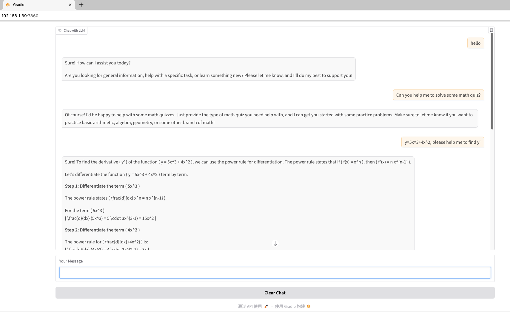

# 转化步骤：

1. 第二阶段训练完，会获得 deepspeed 保存的 checkpoint。调用 train_scripts/convert_pt.py 把训练完成之后的权重，转化成可以预测的权重。主要是去掉 student.的中间名
```bash
python train_scripts/convert_pt.py --model_path /home/yueyulin/model/qwen_1.5b_a800/gatefree_40m_by_7b_model.bin --output_path /home/yueyulin/model/qwen_1.5b_a800/qwen_1.5b_v7_gatefree_by_7b --original_model_path /home/yueyulin/models/Qwen2.5-1.5B-Instruct/ --copy_mlp_from_original
```
2. 转化成 HF 格式。

   2.1 创建目标目录
   ```bash
   mkdir /home/yueyulin/model/qwen_1.5b_v7_gatefree_by_7b
   ```
   2.2 拷贝配置文件到目标目录
   ```bash
   cp configs/ARWKV-1.5B/* /home/yueyulin/model/qwen_1.5b_v7_gatefree_by_7b/
   ```
   2.3 运行转化程序
   ```bash
   python test/convert_2_hf.py --config_file configs/qwen_1.5b.yaml --ckpt_file /home/yueyulin/model/qwen_1.5b_a800/qwen_1.5b_v7_gatefree_by_7b --output_config_dir /home/yueyulin/model/qwen_1.5b_v7_gatefree_by_7b/
   ```

3. 运行 HF 版本的模型

   3.1 测试是否正确
   ```bash
   python test/test_hf.py /home/yueyulin/model/qwen_1.5b_v7_gatefree_by_7b/
   ```
   输出：
   ```bash
   	Streaming output:
	Setting `pad_token_id` to `eos_token_id`:151645 for open-end generation.
	Certainly! Large language models (LLMs) represent a significant advancement in artificial intelligence. They are advanced machine learning systems capable of generating human-like text on various topics, such as text generation, translation, and creative writing, among others. 

	Key features of large language models include extensive vocabulary, vast amounts of training data (millions to billions of training records for each language model), and advanced neural network architectures. These models are capable of generating human-like text for a wide range of tasks, from translating from one language to another to writing creative content, including essays, novels, stories, and more.

	While large language models are remarkable in generating human-like text, they are not perfect and may generate some content in error or misinformation, especially when generating specific and nuanced topics. Thus, it's essential to use them with caution and appropriate supervision during training and deployment.

	Some common examples of popular large language models include GPT (Generative Pre-trained Transformer), Megatron-LM (Multi-task Large Language Model), and BLOOM (Bloom Language Model). These models are continually refined and updated to improve performance and accuracy.
    ```
   3.2 测试 gradio
    ```bash
   python test/test_hf_gradio.py /home/yueyulin/model/qwen_1.5b_v7_gatefree_by_7b/
    ```
    