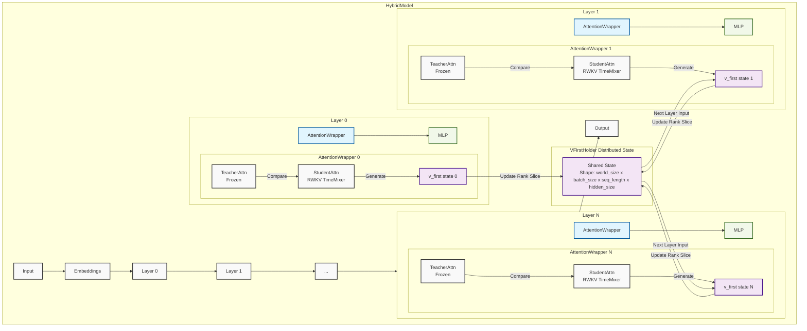

# RWKVInside

# HybridModel Overview

```mermaid
flowchart TB
    subgraph HybridModel
        input[Input] --> Embeddings
        Embeddings --> L0[Layer 0]
        
        subgraph Layer0[Layer 0]
            direction LR
            A0[AttentionWrapper] --> MLP0[MLP]
            subgraph AW0[AttentionWrapper 0]
                direction TB
                TA0[TeacherAttn\nFrozen] --> |Compare|SA0[StudentAttn\nRWKV TimeMixer]
                SA0 --> |Generate|VF0[v_first state 0]
            end
        end
        
        subgraph Layer1[Layer 1]
            direction LR
            A1[AttentionWrapper] --> MLP1[MLP]
            subgraph AW1[AttentionWrapper 1]
                direction TB
                TA1[TeacherAttn\nFrozen] --> |Compare|SA1[StudentAttn\nRWKV TimeMixer]
                SA1 --> |Generate|VF1[v_first state 1]
            end
        end
        
        subgraph LayerN[Layer N]
            direction LR
            AN[AttentionWrapper] --> MLPN[MLP]
            subgraph AWN[AttentionWrapper N]
                direction TB
                TAN[TeacherAttn\nFrozen] --> |Compare|SAN[StudentAttn\nRWKV TimeMixer]
                SAN --> |Generate|VFN[v_first state N]
            end
        end
        
        L0 --> L1[Layer 1]
        L1 --> LN[...]
        LN --> LayerN
        LayerN --> output[Output]
        
        subgraph VFirstHolder[VFirstHolder Distributed State]
            direction TB
            VS[Shared State\nShape: world_size x batch_size x seq_length x hidden_size]
        end
        
        %% v_first flow connections
        VF0 --> |Update Rank Slice|VS
        VS --> |Next Layer Input|VF1
        VF1 --> |Update Rank Slice|VS
        VS --> |Next Layer Input|VFN
        VFN --> |Update Rank Slice|VS
    end
    
    classDef default fill:#f9f9f9,stroke:#333,stroke-width:2px;
    classDef attention fill:#e1f5fe,stroke:#01579b,stroke-width:2px;
    classDef vfirst fill:#f3e5f5,stroke:#4a148c,stroke-width:2px;
    classDef mlp fill:#f1f8e9,stroke:#33691e,stroke-width:2px;
    
    class A0,A1,AN attention;
    class VF0,VF1,VFN,VS vfirst;
    class MLP0,MLP1,MLPN mlp;
```