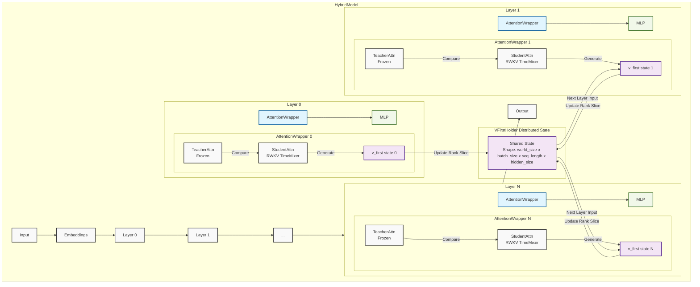
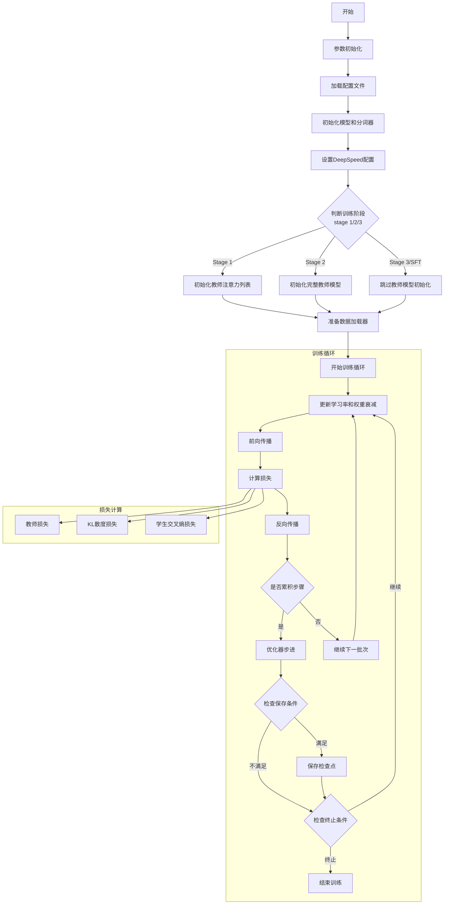
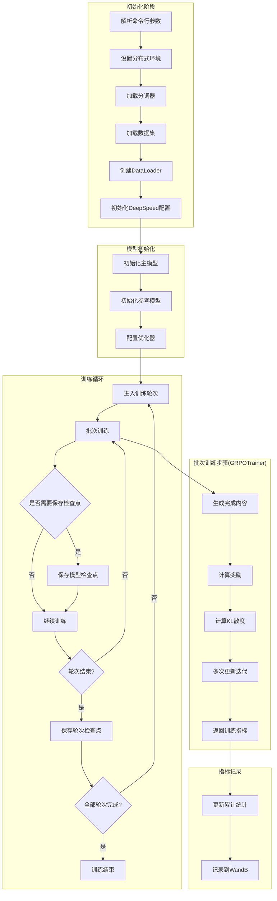
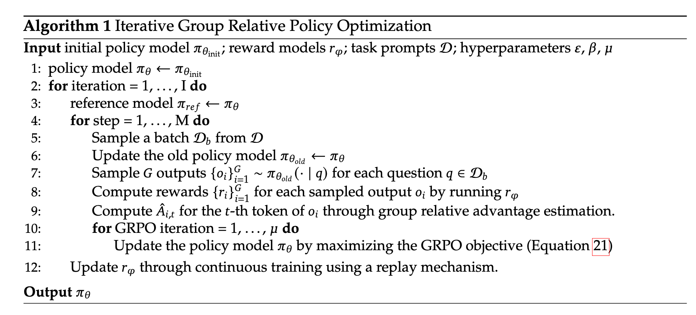

# RWKVInside

# HybridModel Overview



## Training Process


### Training shell

The training shell is the train.sh. Please  refer the train_memo.txt for more details for training in different stages.

## RL Training Process



### GRPO Algorithm from https://arxiv.org/pdf/2402.03300v3



The implementation of GRPO algorithm is rl/grpo_trainer.py , please refer the code for more details. TRL just eliminates the GRPO iteration and ignore the memory efficiency for large data in relative small machines. That's why we implement our own GRPO algorithm.
# Training 🔥

## Data preparation 🤗
- prepare input Raw data in [input_Raw_data_dir]
### Datasets Format(Jsonl format)
{"text": "<｜begin▁of▁sentence｜>A conversation between User and Assistant. The user asks a question, and the Assistant solves it. The assistant first thinks about the reasoning process in the mind and then provides the user with the answer. The reasoning process are enclosed within <think> </think>, i.e., <think> reasoning process here </think>**Final Answer:**\nanswer here. 
<｜User｜>......<｜Assistant｜>\n<think>\n......\n</think>\n\n......<｜end▁of▁sentence｜>"}

## Build Environment 🤯
```bash
sudo apt install python3.12-venv
```
```bash
python -m venv .venv --system-site-packages
source .venv/bin/activate
pip install torch torchvision torchaudio gradio rwkv-fla accelerate deepspeed wandb 
git clone https://github.com/uniartisan/transformers.git
cd ./transformers
pip install . 
```

## Train model 😋
- AMD hipcc Compile extra_cuda_cflags: '-xhip', '-fopenmp', '-ffast-math', '-O3', '--offload-arch=gfx1100','-munsafe-fp-atomics'
- Nvidia nvcc Compile extra_cuda_cflags: '-res-usage', '--maxrregcount 60', '--use_fast_math', '-O3', '-Xptxas -O3'

### Stage 1 
- Training for Qwen 0.5B with Norm

```bash
sh train.sh -c configs/qwen_0.5b.yaml -l 0.0001 -f 0.00001 -m 2048 -b 2 -r "[input_Raw_data_dir_1] [input_Raw_data_dir_2] [input_Raw_data_dir_3]..." -o [output_model_path]  -g 1 -F 0 -d 1 -t 1000_000_000 -T 0.2 -R v7 -s 1 -M 1 -G [Use GPU number]
```
### Stage 2
- Training for Qwen 0.5B with Norm
```bash
sh train.sh -c configs/qwen_0.5b.yaml -l 0.0001 -f 0.00001 -m 2048 -b 2 -r "[input_Raw_data_dir_1] [input_Raw_data_dir_2] [input_Raw_data_dir_3]..." -o [Stage_1_output_model_dir]  -g 1 -F 0 -d 1 -t 1000_000_000 -T 0.2 -R v7 -s 2 -k [output_deepspeed_model_weight_dir] -M 1 -G [Use GPU number]
```

- Training for Qwen 0.5B with Norm and freez mlp
```bash
sh train.sh -c configs/qwen_0.5b.yaml -l 0.0001 -f 0.00001 -m 2048 -b 2 -r "[input_Raw_data_dir_1] [input_Raw_data_dir_2] [input_Raw_data_dir_3]..." -o [Stage_1_output_model_dir]  -g 1 -F 0 -d 1 -t 1000_000_000 -T 0.2 -R v7 -s 2 -k [output_deepspeed_model_weight_dir] -M 1 -z 1 -G [Use GPU number]
```

- Training for Qwen 0.5B with Norm and freez mlp and use another teacher model
```bash
sh train.sh -c configs/qwen_0.5b.yaml -l 0.0001 -f 0.00001 -m 2048 -b 2 -r "[input_Raw_data_dir_1] [input_Raw_data_dir_2] [input_Raw_data_dir_3]..." -o [Stage_1_output_model_dir]  -g 1 -F 0 -d 1 -t 1000_000_000 -T 0.2 -R v7 -s 2 -k [output_deepspeed_model_weight_dir] -M 1 -z 1 -i [Another_Instruct_teacher_model_dir_with_config] -G [Use GPU number]
```

[Jump to document describes the usage of the `train.sh` script for model training with DeepSpeed](./Train.md)

### Save checkpoint 

```bash
python ./train_scripts/save_checkpoint.py [checkpoint_dir] [output_dir]
```

### If you want to train on AMD GPU (Test passed on Ubuntu 24.04 with W7900)🤯
#### 1. [install ROCM Doc on Official Documentation](https://rocm.docs.amd.com/projects/install-on-linux/en/latest/install/install-methods/package-manager-index.html)
#### 2. Build Environment
```bash
sudo apt install python3.12-venv
```
```bash
python -m venv .venv --system-site-packages
source .venv/bin/activate
```
```bash
pip install torch torchvision torchaudio --index-url https://download.pytorch.org/whl/rocm6.2.4
pip install gradio rwkv-fla accelerate deepspeed 
```
```bash
git clone https://github.com/uniartisan/transformers.git
cd ./transformers
pip install . 
```
#### 3. Because cupy only supports up to ROCm5.0 so we need to remove “impot cupy”
#### 4. Modify ./cuda/wkv7_cuda.cu 
```cpp
using bf = __nv_bfloat16;
__device__ inline float to_float(const bf & u) { return __bfloat162float(u); }
__device__ inline bf to_bf(const float & u) { return __float2bfloat16_rn(u); }
```
to
```cpp
using bf = __nv_bfloat16;
__device__ inline float to_float(const bf & u) { return __bfloat162float(u); }
__device__ inline bf to_bf(const float & u) { return __float2bfloat16(u); }
```
#### 5. Change All deepspeed ```backend='nccl'``` to ```backend='rccl'``` in ./train_scripts/train_hybrid_deepspeed.py 
#### 6.Change All 
```python
extra_cuda_cflags=[f'-D_C_={HEAD_SIZE}',"-res-usage", "--use_fast_math", "-O3", "-Xptxas -O3", "--extra-device-vectorization"]
```
to
```python
[f'-D_C_={HEAD_SIZE}', f"-D_CHUNK_LEN_={CHUNK_LEN}", '-xhip', '-fopenmp', '-ffast-math', '-O3', '--offload-arch=gfx1100','-munsafe-fp-atomics']
```
in ```./rwkv_inside/TimeMixer.py```

# Infrence on Nvidia GPU 🚀

## prepare model
1. convert deepspeed model to pytorch format  

```bash
python ./train_scripts/convert_pt.py --model_path [input_model_dir_path] --output_path [output_model_dir_path] --original_model_path [dir_of_the_original_qwen_model]
```
2. convert pytorch model to hf format for Infrence

```bash
python ./test/convert_2_hf.py --config_file [input_config_file] --ckpt_file [input_deepspeed_model_weight_dir] --output_config_dir [output_config_dir]
```

## Test model
1. test chat in cli
```bash
python ./test/test_chat_cli.py [model_config_dir]
```
2. test test caht in gradio with thinking
```bash
python ./test/test_hf_gradio_thinking.py [model_config_dir]
```
3. test chat in gradio with fp16
```bash
python ./test/test_hf_gradio.py [model_config_dir]
```
4. test by a single prompt with fp16
```bash
python ./test/test_hf.py [model_config_dir]
```

# Infrence on AMD Radeon GPU (Test passed on Ubuntu 24.04 with W7900 & RX6750xt)🚀
1. [install ROCM Doc on Official Documentation](https://rocm.docs.amd.com/projects/install-on-linux/en/latest/install/install-methods/package-manager-index.html)
2. Build Environment
```bash
sudo apt install python3.12-venv
```
```bash
python -m venv .venv --system-site-packages
source .venv/bin/activate
```
```bash
pip install torch torchvision torchaudio --index-url https://download.pytorch.org/whl/rocm6.2.4
pip install gradio rwkv-fla accelerate deepspeed cupy
```
```bash
git clone https://github.com/uniartisan/transformers.git
cd ./transformers
pip install . 
```
## prepare model
1. convert deepspeed model to hf format 
```bash
python test/convert_2_hf.py --config_file [input_config_file] --ckpt_file [input_deepspeed_model_weight_dir] --output_config_dir [output_config_dir]
```

## Test model
1. test chat in cli
```bash
python ./test/test_chat_cli.py [model_config_dir]
```
2. test test caht in gradio with thinking
```bash
python ./test/test_hf_gradio_thinking.py [model_config_dir]
```
3. test chat in gradio with fp16
```bash
python ./test/test_hf_gradio.py [model_config_dir]
```
4. test by a single prompt with fp16
```bash
python ./test/test_hf.py [model_config_dir]
