# RWKVInside

# HybridModel Overview


## Training Process

```mermaid
graph TD
    A[开始] --> B[参数初始化]
    B --> C[加载配置文件]
    C --> D[初始化模型和分词器]
    D --> E[设置DeepSpeed配置]
    
    E --> F{判断训练阶段<br>stage 1/2/3}
    
    F -->|Stage 1| G1[初始化教师注意力列表]
    F -->|Stage 2| G2[初始化完整教师模型]
    F -->|Stage 3/SFT| G3[跳过教师模型初始化]
    
    G1 --> H[准备数据加载器]
    G2 --> H
    G3 --> H
    
    H --> I[开始训练循环]
    
    subgraph 训练循环
        I --> J[更新学习率和权重衰减]
        J --> K[前向传播]
        K --> L[计算损失]
        L --> M[反向传播]
        M --> N{是否累积步骤}
        N -->|是| O[优化器步进]
        N -->|否| P[继续下一批次]
        O --> Q{检查保存条件}
        P --> J
        Q -->|满足| R[保存检查点]
        Q -->|不满足| S{检查终止条件}
        R --> S
        S -->|继续| J
        S -->|终止| T[结束训练]
    end
    
    subgraph 损失计算
        L --> L1[教师损失]
        L --> L2[KL散度损失]
        L --> L3[学生交叉熵损失]
    end
```
### Training shell

The training shell is the train.sh. Please  refer the train_memo.txt for more details for training in different stages.

## RL Training Process

```mermaid
flowchart TB
    subgraph Init["初始化阶段"]
        A[解析命令行参数] --> B[设置分布式环境]
        B --> C[加载分词器]
        C --> D[加载数据集]
        D --> E[创建DataLoader]
        E --> F[初始化DeepSpeed配置]
    end

    subgraph Models["模型初始化"]
        F --> G[初始化主模型]
        G --> H[初始化参考模型]
        H --> J[配置优化器]
    end

    subgraph Training["训练循环"]
        J --> K[进入训练轮次]
        K --> L[批次训练]
        L --> M{是否需要保存检查点}
        M -->|是| N[保存模型检查点]
        M -->|否| O[继续训练]
        N --> O
        O --> P{轮次结束?}
        P -->|否| L
        P -->|是| Q[保存轮次检查点]
        Q --> R{全部轮次完成?}
        R -->|否| K
        R -->|是| S[训练结束]
    end

    subgraph TrainStep["批次训练步骤(GRPOTrainer)"]
        L --> T[生成完成内容]
        T --> U[计算奖励]
        U --> V[计算KL散度]
        V --> W[多次更新迭代]
        W --> X[返回训练指标]
    end

    subgraph Metrics["指标记录"]
        X --> Y[更新累计统计]
        Y --> Z[记录到WandB]
    end
```



### GRPO Algorithm from https://arxiv.org/pdf/2402.03300v3


The implementation of GRPO algorithm is rl/grpo_trainer.py , please refer the code for more details. TRL just eliminates the GRPO iteration and ignore the memory efficiency for large data in relative small machines. That's why we implement our own GRPO algorithm.
# Training 🔥

## Data preparation 🤗
- prepare input Raw data in [input_Raw_data_dir]
## Build Environment 🤯
```bash
sudo apt install python3.12-venv
```
```bash
python -m venv .venv --system-site-packages
source .venv/bin/activate
pip install torch torchvision torchaudio gradio rwkv-fla accelerate deepspeed cupy
git clone https://github.com/uniartisan/transformers.git
cd ./transformers
pip install . 
```
## Train model 😋
- AMD complite Config '-xhip', '-fopenmp', '-ffast-math', '-O3', '--offload-arch=gfx1100','-munsafe-fp-atomics'
- Nvidia complite Config '-res-usage', '--maxrregcount 60', '--use_fast_math', '-O3', '-Xptxas -O3'
### Stage 1 
- Training for Qwen 0.5B with Norm

```bash
sh train.sh -c configs/qwen_0.5b.yaml -l 0.0001 -f 0.00001 -m 2048 -b 2 -r "[input_Raw_data_dir_1] [input_Raw_data_dir_2] [input_Raw_data_dir_3]..." -o [output_model_path]  -g 1 -F 0 -d 1 -t 1000_000_000 -T 0.2 -R v7 -s 1 -M 1
```
### Stage 2
- Training for Qwen 0.5B with Norm
```bash
sh train.sh -c configs/qwen_0.5b.yaml -l 0.0001 -f 0.00001 -m 2048 -b 2 -r "[input_Raw_data_dir_1] [input_Raw_data_dir_2] [input_Raw_data_dir_3]..." -o [Stage_1_output_model_dir]  -g 1 -F 0 -d 1 -t 1000_000_000 -T 0.2 -R v7 -s 2 -k [output_deepspeed_model_weight_dir] -M 1
```

- Training for Qwen 0.5B with Norm and freez mlp
```bash
sh train.sh -c configs/qwen_0.5b.yaml -l 0.0001 -f 0.00001 -m 2048 -b 2 -r "[input_Raw_data_dir_1] [input_Raw_data_dir_2] [input_Raw_data_dir_3]..." -o [Stage_1_output_model_dir]  -g 1 -F 0 -d 1 -t 1000_000_000 -T 0.2 -R v7 -s 2 -k [output_deepspeed_model_weight_dir] -M 1 -z 1
```

- Training for Qwen 0.5B with Norm and freez mlp and use another teacher model
```bash
sh train.sh -c configs/qwen_0.5b.yaml -l 0.0001 -f 0.00001 -m 2048 -b 2 -r "[input_Raw_data_dir_1] [input_Raw_data_dir_2] [input_Raw_data_dir_3]..." -o [Stage_1_output_model_dir]  -g 1 -F 0 -d 1 -t 1000_000_000 -T 0.2 -R v7 -s 2 -k [output_deepspeed_model_weight_dir] -M 1 -z 1 -i [Another_Instruct_teacher_model_dir_with_config]
```

[Jump to document describes the usage of the `train.sh` script for model training with DeepSpeed](./Train.md)

#### Because cupy only supports up to ROCm5.0, it cannot be trained on AMDGPU, but ROCM Pytorch can be used for infrence.

# Infrence on Nvidia GPU 🚀

## prepare model
1. convert deepspeed model to hf format 
```bash
python test/convert_2_hf.py --config_file [input_config_file] --ckpt_file [input_deepspeed_model_weight_dir] --output_config_dir [output_config_dir]
```

## Test model
1. test chat in cli
```bash
python ./test/test_chat_cli.py [model_config_dir]
```
2. test test caht in gradio with thinking
```bash
python ./test/test_hf_gradio_thinking.py [model_config_dir]
```
3. test chat in gradio with fp16
```bash
python ./test/test_hf_gradio.py [model_config_dir]
```
4. test by a single prompt with fp16
```bash
python ./test/test_hf.py [model_config_dir]
```

# Infrence on AMD Radeon GPU (Test on Ubuntu 24.04 with W7900 & RX6750xt)🚀
1. [install ROCM Doc on Official Documentation](https://rocm.docs.amd.com/projects/install-on-linux/en/latest/install/install-methods/package-manager-index.html)
2. Build Environment
```bash
sudo apt install python3.12-venv
```
```bash
python -m venv .venv --system-site-packages
source .venv/bin/activate
pip install torch torchvision torchaudio --index-url https://download.pytorch.org/whl/rocm6.2.4
pip install gradio rwkv-fla accelerate deepspeed cupy
git clone https://github.com/uniartisan/transformers.git
cd ./transformers
pip install . 
```
## prepare model
1. convert deepspeed model to hf format 
```bash
python test/convert_2_hf.py --config_file [input_config_file] --ckpt_file [input_deepspeed_model_weight_dir] --output_config_dir [output_config_dir]
```

## Test model
1. test chat in cli
```bash
python ./test/test_chat_cli.py [model_config_dir]
```
2. test test caht in gradio with thinking
```bash
python ./test/test_hf_gradio_thinking.py [model_config_dir]
```
3. test chat in gradio with fp16
```bash
python ./test/test_hf_gradio.py [model_config_dir]
```
4. test by a single prompt with fp16
```bash
python ./test/test_hf.py [model_config_dir]